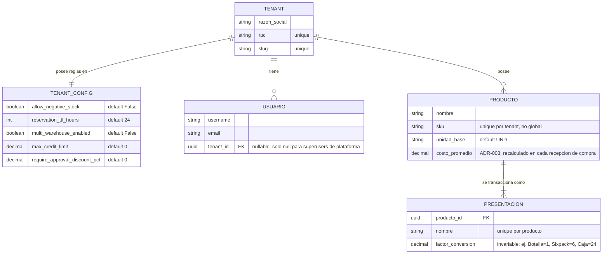

# 01a - ERD Core y Catalogo

Entidades de `apps.core` y `apps.catalog`. Ver reglas generales del ORM en
[01 - ERD y Modelos de Datos](01%20-%20ERD%20y%20Modelos%20de%20Datos.md).

## Notas
* `TENANT_CONFIG` es 1 a 1 con `TENANT`, se crea automaticamente via signal al crear el Tenant (ver `apps/core/signals.py`).
* `USUARIO` (`apps.core.User`) no hereda `BaseModel` — es un `AbstractUser` de Django con un campo `tenant` agregado.
* `PRESENTACION.producto` es obligatorio (no nullable): la base de datos rechaza una Presentacion sin Producto.
