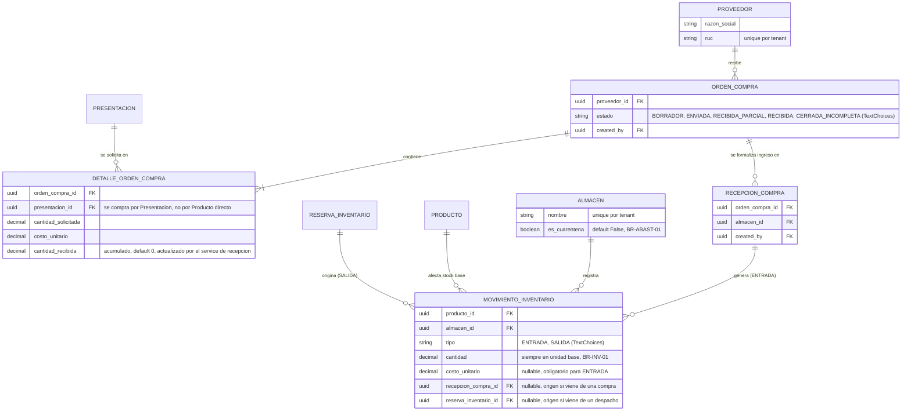

# 01b - ERD Compras e Inventario

Entidades de `apps.inventory`. `RESERVA_INVENTARIO` se define en
[01c - ERD Ventas y Finanzas](01c%20-%20ERD%20Ventas%20y%20Finanzas.md) pero
se referencia aqui porque origina movimientos de Kardex.

## Notas
* `MOVIMIENTO_INVENTARIO` es **INMUTABLE** (`ADR-009`): `save()`/`delete()` se niegan a modificar o borrar un registro ya creado.
* El stock de un producto no es una columna: se calcula sumando `ENTRADA` y restando `SALIDA` de `MOVIMIENTO_INVENTARIO`, **excluyendo siempre** los movimientos cuyo `Almacen.es_cuarentena=True` (ver `BR-ABAST-01`).
* `DETALLE_ORDEN_COMPRA` no es inmutable: `cantidad_recibida` se actualiza en cada recepcion parcial.
