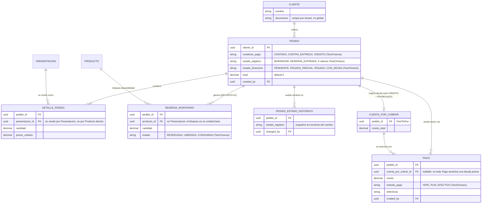

# 01c - ERD Ventas y Finanzas

Entidades de `apps.sales` y `apps.finance`. `PRODUCTO`/`PRESENTACION` se
definen en [01a](01a%20-%20ERD%20Core%20y%20Catalogo.md), `MOVIMIENTO_INVENTARIO`
en [01b](01b%20-%20ERD%20Compras%20e%20Inventario.md).

## Notas
* `PEDIDO_ESTADO_HISTORICO` y `CUENTA_POR_COBRAR`/`PAGO` son **INMUTABLES** (`ADR-009`).
* `CUENTA_POR_COBRAR` no almacena `monto_pagado` ni `saldo` — son `@property` calculados agregando los `PAGO` asociados, para no violar la inmutabilidad.
* El ciclo de `estado_logistico` lo orquesta `apps/sales/services.py`: `confirmar_pedido` → `avanzar_a_preparacion` → `despachar_pedido` → `confirmar_entrega`.

## Pendiente de implementar
* **`EntregaPedido`** (mencionada en `docs/business/01` como "registro de la visita del repartidor al cliente") **todavia no existe en codigo**. Hoy `confirmar_entrega` resuelve el resultado final (ENTREGADO/FALLIDO) pero no registra el detalle de la visita en si (hora, firma, fotos, etc.). Se agrega cuando haya un requerimiento real de ese detalle operativo.
